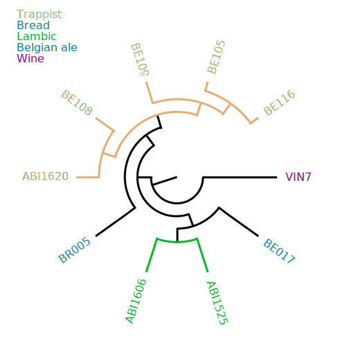

# sprake

Sprake is a Python 3 command-line tool and API for rendering
phylogenetic trees.

By default it will just render a straight black-and-white tree, but if
you have a CSV file with metadata about the nodes you can use style
rules to change formatting of nodes based on their properties.

Supported output formats: PNG, SVG, and PDF.

## Example output



## Simple usage

```
python3 sprake-cli.py tree.nwk --format PDF
```

This will produce the output in `tree.pdf`.

To use style rules:

```
python3 sprake-cli.py tree.nwk --format PDF --data tree.csv --style tree.style
```

To run the examples yourself, run:

```
python3 sprake-cli.py examples/scer-x-skud.nwk --data examples/scer-x-skud.csv \\
  --style examples/scer-x-skud.style --format SVG
```

## Examples of style

Let's say `tree.csv` looks like this:

| ID | POF   |
| -- | ----- |
| A  | True  |
| B  | False |

If you then declare the following in `tree.style`:

```
POF=True,dotcolor=#FF0000
POF=False,dotcolor=#0000FF
```

Then node A will get a red dot next to its name, and node B will get a
blue dot.

You can also change text color, line color, line thickness, and so on.
Example:

```
culture=1, textcolor=#b3059e, linecolor=#b3059e, linewidth=2
culture=2, textcolor=#4dab4d, linecolor=#4dab4d, linewidth=2
```

(The file format for style rules is going to change. The syntax above
is temporary while a better format is being designed.)

## Output formats

| Format | Requirements | Status      |
| ------ | ------------ | ----------- |
| PDF    | fpdf2        | Quite good  |
| SVG    | -            | Good        |
| PNG    | PIL          | Not working |
